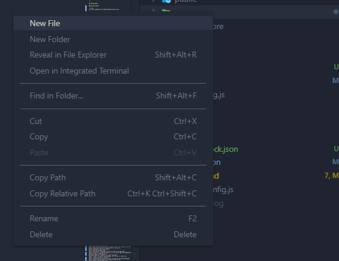

# Open LXP

[](https://github.com/OpenLXP/openlxp-xds-ui)
[](https://yarnpkg.com/)
[](https://github.com/OpenLXP/openlxp-xds-ui/blob/main/LICENSE)

[](https://reactjs.org/)
[](https://redux-toolkit.js.org/)
[](https://reactrouter.com/web/guides/quick-start)
[](https://redux-toolkit.js.org/)

## Table of content

- [**Installation**](#installation)
  - [Clone Project](#clone-project)
- [**Getting started**](#getting-started)
  - [Installation](#installation)
    - [_Clone Project_](#clone-project)
    - [_Install Project Dependencies_](#install-project-dependencies)
  - [Environment Variables](#environment-variables)
    - [_REACT_APP_BACKEND_HOST_](#react-app-backend-host)
    - [_REACT_APP_ES_API_](#react-app-es-api)
    - [_REACT_APP_ES_MULT_API_](#react-app-es-mult_api)
    - [_REACT_APP_AUTH_](#react-app-auth)
    - [_REACT_APP_CONFIGURATION_API_](#react-app-configuration-api)
    - [_REACT_APP_EXPERIENCES_](#react-app-experiences)
    - [_REACT_APP_ADD_COURSE_TO_LISTS_](#react-app-add-course-to-lists)
    - [_REACT_APP_INTEREST_LISTS_ALL_](#react-app-interest-lists-all)
    - [_REACT_APP_USER_SUBSCRIPTION_LISTS_](#react-app-user-subscription-lists)
    - [_REACT_APP_USER_INTEREST_LISTS_](#react-app-user-interest-lists)
  - [Creating a local env](#creating-a-local-environment-file)
    - [_Walk through_](#walk-through)
    - [_Template_](#env-template)
  - [Important Notes](#important-notes)
- [**Available Scripts**](#available-scripts)
  - [yarn start](#yarn-start)
  - [yarn test](#yarn-test)
  - [yarn build](#yarn-build)
  - [yarn coverage](#yarn-coverage)

---

## Installation

### Clone Project

```bash
git clone git@github.com:OpenLXP/openlxp-xds-ui.git
```

### Install Project Dependencies

Start off by verifying that you have `yarn` installed.

```ps1
yarn -version
```

If `yarn` is not installed use the following command to install it. This will install the `yarn` package manager globally on your system.

_**global install**_

```ps1
npm install yarn -g
```

_**local install**_

```ps1
npm install yarn
```

Once yarn has been installed you will need to install the project dependencies. Using the following command we will manually set your yarn version for this project.

```ps1
yarn set version 1.22.1
```

After the version has been installed and set we will install the dependencies. Using the following command we will install all the project dependencies.

```bash
yarn install package.json
```

---

## Getting started

### Environment Variables

This project makes use of globally available environment variables. Below are the required environment variables required for this project.

#### **Endpoint Name**

Description of the endpoint

```yaml
http://<YOUR_BACKEND_ENDPOINT>/
```

#### **Endpoint Name**

Description of the endpoint

```yaml
http://<YOUR_BACKEND_ENDPOINT>/
```

#### **Endpoint Name**

Description of the endpoint

```yaml
http://<YOUR_BACKEND_ENDPOINT>/
```

#### **Endpoint Name**

Description of the endpoint

```yaml
http://<YOUR_BACKEND_ENDPOINT>/
```

#### **Endpoint Name**

Description of the endpoint

```yaml
http://<YOUR_BACKEND_ENDPOINT>/
```

#### **Endpoint Name**

Description of the endpoint

```yaml
http://<YOUR_BACKEND_ENDPOINT>/
```

### Creating a local environment file

#### **Walk through**

Let's create a local `.env.local` file. If you are in a code editor you can right click and create new file.



If you are using the terminal use the following command to create a new file.

_**bash command**_

```bash
touch <PATH_TO_YOUR_PROJECT_ROOT>/.env.local
```

_**powershell**_

```ps1
New-Item -Path <PATH_TO_YOUR_PROJECT_ROOT>\.env.local -ItemType File
```

Navigate to the newly created file and paste the template (_below_) into the file. Replace `<YOUR_BACKEND_ENDPOINT>` with your localhost setup **or** your live endpoint.

#### **.env Template**

```text
REACT_APP_BACKEND_HOST=<YOUR_BACKEND_ENDPOINT>
REACT_APP_ES_API=<YOUR_BACKEND_ENDPOINT>/es-api/
REACT_APP_MLT_API=<YOUR_BACKEND_ENDPOINT>/es-api/more-like-this/
REACT_APP_AUTH=<YOUR_BACKEND_ENDPOINT>/api/auth
REACT_APP_CONFIGURATION_API=<YOUR_BACKEND_ENDPOINT>/api/configuration
REACT_APP_EXPERIENCES=<YOUR_BACKEND_ENDPOINT>/api/experiences/
REACT_APP_ADD_COURSE_TO_LISTS=<YOUR_BACKEND_ENDPOINT>/api/experiences/
REACT_APP_INTEREST_LISTS_ALL=<YOUR_BACKEND_ENDPOINT>/api/interest-lists/
REACT_APP_USER_SUBSCRIPTION_LISTS=<YOUR_BACKEND_ENDPOINT>/api/interest-lists/subscriptions
REACT_APP_USER_INTEREST_LISTS=<YOUR_BACKEND_ENDPOINT>/api/interest-lists/owned
```

### Important Notes

To use this piece of code without any issues you will need the XDS component too.

[OpenLXP XDS](https://github.com/OpenLXP/openlxp-xds)

### **You're all set! Explore the commands below to run, build, or test the app.**

---

## Available Scripts

In the project directory, you can run the following.

### `yarn start`

Runs the app in the development mode.\
Open [http://localhost:3000](http://localhost:3000) to view it in the browser.

The page will reload if you make edits.\
You will also see any lint errors in the console.

### `yarn test`

Launches the test runner in the interactive watch mode.\
See the section about [running tests](https://facebook.github.io/create-react-app/docs/running-tests) for more information.

### `yarn build`

Builds the app for production to the `build` folder.\
It correctly bundles React in production mode and optimizes the build for the best performance.

The build is minified and the filenames include the hashes.\
Your app is ready to be deployed!

See the section about [deployment](https://facebook.github.io/create-react-app/docs/deployment) for more information.

### `yarn coverage`

Launches the test runner with coverage mode enabled.
See the section about [running tests](https://facebook.github.io/create-react-app/docs/running-tests) for more information.

## Learn More

You can learn more in the [Create React App documentation](https://facebook.github.io/create-react-app/docs/getting-started).

To learn React, check out the [React documentation](https://reactjs.org/).

### Code Splitting

This section has moved here: [https://facebook.github.io/create-react-app/docs/code-splitting](https://facebook.github.io/create-react-app/docs/code-splitting)

### Analyzing the Bundle Size

This section has moved here: [https://facebook.github.io/create-react-app/docs/analyzing-the-bundle-size](https://facebook.github.io/create-react-app/docs/analyzing-the-bundle-size)

### Making a Progressive Web App

This section has moved here: [https://facebook.github.io/create-react-app/docs/making-a-progressive-web-app](https://facebook.github.io/create-react-app/docs/making-a-progressive-web-app)

### Advanced Configuration

This section has moved here: [https://facebook.github.io/create-react-app/docs/advanced-configuration](https://facebook.github.io/create-react-app/docs/advanced-configuration)

### Deployment

This section has moved here: [https://facebook.github.io/create-react-app/docs/deployment](https://facebook.github.io/create-react-app/docs/deployment)

### `yarn build` fails to minify

This section has moved here: [https://facebook.github.io/create-react-app/docs/troubleshooting#npm-run-build-fails-to-minify](https://facebook.github.io/create-react-app/docs/troubleshooting#npm-run-build-fails-to-minify)

---

### Core Configurations in Django admin console

Basic Configurations
XDS Configurations:
Enter target metadata api (ex:http://openlxp-xis:8020/api/metadata/)
Xdsui configurations:
Enter Search results per page (ex:10)
Select XDS Configuration from previous step (ex:1)
optional - Add course image to display on every course image
Course information mapping: Course details page mapping
Enter course title corresponding to elastic search (ex:Course.CourseTitle)
Enter course description corresponding to elastic search (ex:Course.CourseShortDescription)
Enter course url corresponding to elastic search (ex:CourseInstance.CourseURL)
Select XDS UI Configuration from previous step (ex:1)

Optional Configurations
Course detail highlights: configure details to display pertaining to each course
Enter display name (ex:End Date)
Enter field name as correlating to elastic search (ex: General_Information.EndDate)
Select XDS UI Configuration from previous step (ex:1)
Select highlight icon (ex:calendar)
Enter rank for display order
Course spotlights: spotlight courses to show up on home page
Enter course id from search engine or url of course page (ex:0b89c4f7ba43c5e076cf621d0e567c60)
Reciever email configurations:
Add email address of people to recieve log data
Search filter: on search results page, set filters to search by
Enter a display name (ex:Provider)
Enter a field name from elastic search (ex:Course.CourseProviderName)
Select XDS UI Configuration from previous step (ex:1)
Select filter type (ex:Checkbox)
Search sort options:
Enter a display name (ex:Description)
Enter a field name from elastic search (ex:Course.CourseShortDescription)
Select XDS UI Configuration from previous step (ex:1)
Reciever email configurations:
Add email address to send log data from

Other Configurations - usually not to be edited
Expereinces: list of courses that have been added to any interest list
Interest Lists: list of interest lists by owner and list names
Saved Filters: list of saved filter searches
Users: List of users with personal information, can make a staff member setting change here

---
